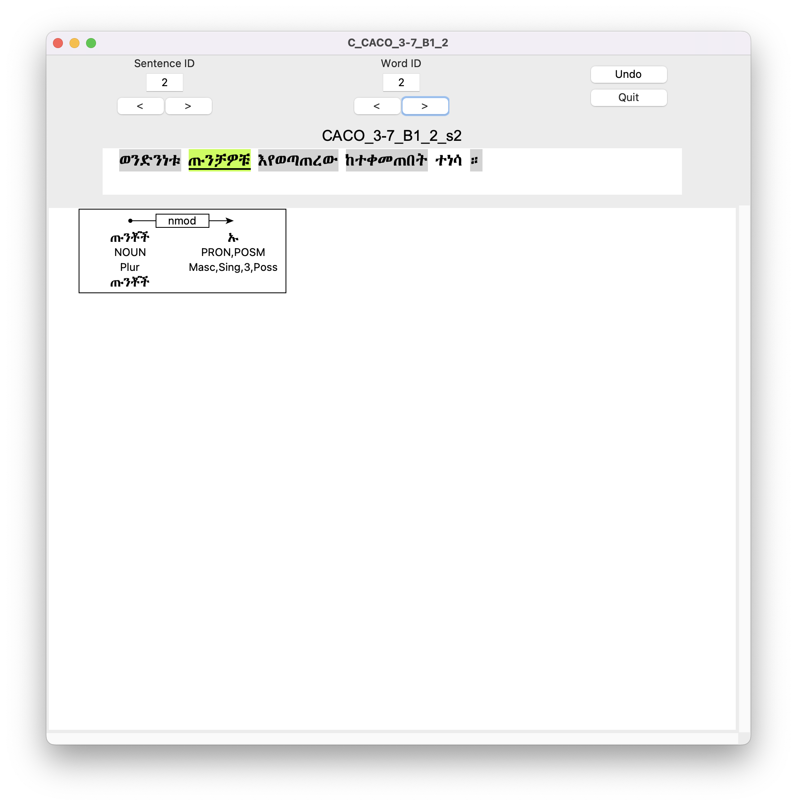

# Version 4.5

This version of **HornMorpho** (HornMorphoAX) is only for Amharic and only for
segmentation.
It segments tokenized sentences from a file, converting the
results to [CoNLL-U format](https://universaldependencies.org/format.html), which can then be written to a file.
There is also a GUI that displays the outputs and allows the user to select a segmentation for ambiguous words.

## Installation

To install HornMorphoAX,  use the latest wheel file, `HornMorphoAX-4.5.*-py3-none-any.whl`, which can be found in the `dist/` folder.

To install from the wheel file, do the following in a Python shell.

	pip install HornMorphoAX-4.*-py3-none-any.whl

(This assumes that you have [wheel](https://pypi.org/project/wheel/) installed.)

Then to use the program, in a Python shell, do

	import hm
	
## Functions

### Segmenting a sentence

**`hm.seg_sentence`**(*sentence*)

`Options: um=1, seglevel=2`

>- *sentence* is a string representation of an Amharic sentence. It is assumed that punctuation has already be separated by whitespace from other characters.

> The function `hm.seg_sentence` attempts to segment the word in the
sentence morphologically. Words may be ambiguous, in which case there
are multiple analyses. Since CoNNL-U format has no place for
ambiguity, only one segmentation is included; this could be the
*wrong* one.

> This function returns an instance of the <a id="sentence">HornMorpho `Sentence` class</a>.
To see the CoNLL-U representation of a `Sentence`, call `serialize()` on the its `conllu` attribute.

> Options:

>* `um` ([Universal Morphology](https://unimorph.github.io/)) specifies the category of morphological features to provide for words and/or word segments. 1 (the default value): features are from the set included in the [Universal Dependency](https://universaldependencies.org/u/feat/all.html) guidelines. 2: features are from an extended set, possibly including those not in the basic UM set. 0: currently ignored.
* `seglevel` specifies how much segmentation to perform. 0: no segmentation; features are assigned to the whole word. 2: maximum segmentation; features are assigned to individual segments (morphemes) within a word. 1: currently ignored.
* `gramfilter` gives the name of a filter `dict`, which causes the function to exclude or include sentences with certain grammatical properties. An example is 'core', which excludes noun arguments that have case markers other than accusasative:

	{'out': ( (('pos', 'n'), ('featfail', FeatStruct("[prep=None]")), )}
   
This excludes sentences (returning `None`) containing a token which has POS `n` and anyting other than `None` for its `prep` feature.

	>>> s = hm.seg_sentence("ልጁን ሥራውን አስጨርሰዋለሁ ።")
	>>> print(s.conllu.serialize())
	
	# text = ልጁን ሥራውን አስጨርሰዋለሁ ።
	# sent_id = _s0
	1-3	ልጁን	_	_	_	_	_	_	_	_
	1	ልጅ	ልጅ	NADJ	NADJ	_	_	_	_	_
	2	ኡ	ኡ	DET	DET	_	1	det	_	_
	3	ን	ን	PART	ACC	Case=Acc	1	case	_	_
	4-6	ሥራውን	_	_	_	_	_	_	_	_
	4	ሥራ	ስራ	NADJ	NADJ	_	_	_	_	_
	5	ኡ	ኡ	DET	DET	_	4	det	_	_
	6	ን	ን	PART	ACC	Case=Acc	4	case	_	_
	7-11	አስጨርሰዋለሁ	_	_	_	_	_	_	_	_
	7	እ	እ	PRON	PRON	Number=Sing|Person=1	8	nsubj	_	_
	8	አስጨርስ	ጨረሰ	VERB	VERB	Aspect=Imp|Voice=Cau	_	_	_	_
	9	ኧው	ው	PRON	OBJC	Gender=Masc|Number=Sing|Person=3	8	obj	_	_
	10	ኣል	ኣል	AUX	AUX	_	8	aux	_	_
	11	ኧሁ	ሁ	PRON	SUBJC	Number=Sing|Person=1	8	nsubj	_	_
	12	።	።	PUNCT	PUNCT	_	_	_	_	_
	
	>>> s = hm.seg_sentence("ልጁን ሥራውን አስጨርሰዋለሁ ።", um=2, seglevel=0)
	>>> print(s.conllu.serialize())
   	
	# text = ልጁን ሥራውን አስጨርሰዋለሁ ።
	# sent_id = _s0
	1	ልጁን	ልጅ	NOUN	NOUN	Case=Acc	_	_	_	_
	2	ሥራውን	ስራ	NOUN	NOUN	Case=Acc	_	_	_	_
	3	አስጨርሰዋለሁ	ጨረሰ	VERB	VERB	AccGen=Masc|AccNum=Sing|AccPers=3|Aspect=Imp|Number=Sing|Person=1|Voice=Cau	_	_	_	_
	4	።	።	PUNCT	PUNCT		_	_	_	_

### Segmenting the sentences in a file

**`hm.seg_file`**(*path*)
`Options: start=0, nlines=0, batch_name='', version='2.2', batch='1.0',`
`um=1, seglevel=2`

>- *path* is a path to a file containing Amharic sentences, one per line. It is assumed that punctuation has been separated by whitespace from other characters.

> The function `hm.seg_file` returns a list of `Sentence` objects.

> Options:

>* `start` specifies the line in the file where you want to start segmenting; it defaults to 0, the first line.
* `n_lines` specifies the number of lines to segment. It defaults to 0, meaning all of the lines.
* `batch_name` is a string representing the name of the batch being segmented. This is used in created the id for each sentence. If not specified, a name is created from the values of `version` and `batch`.
* `version` is a string or float specifying the version of the data being analyzed. It defaults to '2.2'.
* `batch` is a string or float specifying the batch number. It defaults to '1.0'.
* `um`: See `seg_sentence`.
* `seglevel`: See `seg_sentence`.
* `gramfilter`: See `seg_sentence`.

### Writing sentence segmentations to a file

**`hm.write_conllu`**(*sentences*, *path*, *corpus*)

`Options: unk_thresh=0.3, ambig_thresh=1.0`

The function `hm.write_conllu` writes the CoNNL-U representations of a list of sentences (instances of `Sentence`) to a file or to standard output.

>- *sentences* is a list of `Sentence` objects, like those returned by `hm.seg_file` or the `sentences` attribute of a `Corpus` object, like that returned by `hm.create_corpus`. If `sentences` is `None`, the sentences to be written are those in `corpus.sentences`.
>- *path* is a path to the file where the CoNLL-U representations of the sentences are to be written. If `None`, the representations are written to the standard output.
>- *corpus* is a `Corpus` object or `None`.

>Options:

>* `unk_thresh` and `ambig_thresh` control whether and how sentences are excluded from the file. `unk_thresh` is a float representing the maximum proportion of tokens in the sentence that are unknown to HornMorpho. It defaults to 0.3. `ambig_thresh` is a float representing the maximum average number of segmentations for each word beyond one. It defaults to 1.0, that is, two segmentations per word. If either of these thresholds is crossed for a given `Sentence`, it is not written to the file.

### Creating a corpus of disambiguated sentences (starting from 4.5.1)

**`hm.create_corpus`**()

`Options:`
`start=0`, `n_sents=0`, `read={}`, `write={}`, `batch={}`,
`segment=True`, `disambiguate=True`, `conlluify=True`

>`hm.create_corpus()` returns an instance of the `Corpus` class. It gets data, either from the keyword argument *data*, a list of sentences in the form of strings, or if *data* is `None`, from the values in the *read* dict. Depending on values of options, it may also segment the sentences, open the disambiguation GUI, create CoNLL-U representations, and write the CoNNL-U representations to a file.

>Options:

>* `read` is a `dict` with possible keys `path`, `folder`, and `filename`. If `path` is not specified, a path is created from the values of `folder` and `filename`. `filename` should have no extension.
>* `write` is a `dict` with possible keys `stdout`, `path`, `folder`, `filename`, and `annotator`, specifying whether and where CoNLL-U representations of the sentences in the corpus are to be written. If `stdout` is `True`, the representations are written to standard output. Otherwise either `path` is used, if one is given, or, if not, a path is created from `folder` and `filename`. `filename` should have no extension. If `degeminate` is `True` (see below), geminated and ungeminated representations are written to separate files. If there is no `filename`, one is created from the batch name and the value of `annotator`.
>* `batch` is a `dict` with possible keys `name`, `id`, `sent_length`, `version`, and `source`, specifying various properties of the batch being created. A batch name is created from these unless `name` is given.
>* `start` specifies the number of the line (sentence) in the file where you want to start segmenting; it defaults to 0, the first line.
* `n_sents` specifies the number of sentences/lines to read in from the file. It defaults to 0, meaning all of the lines.
* `segment` specifies whether to run `Corpus.segment()` on the sentences (see below).
* `disambiguate` specifies whether to run `Corpus.disambiguate()` on the segmented sentences (see below).
* `conlluify` specifies whether to run `Corpus.conlluify()` on the  segmented (and possibly disambiguated) sentences.
* `degeminate` specifies whether separate degeminated representations are created by `conlluify` and also written to files or standard output.

#### `Corpus` attributes

**`Corpus.data`**

>A list of unsegmented Amharic sentence strings.

**`Corpus.sentences`**

>A list of `Sentence` objects. Initially empty, filled when `Corpus.segment()` is called.

#### `Corpus` methods

**`Corpus.segment()`**

> The `Corpus` method `segment()` runs `hm.seg_sentence()` on the sentence strings in the `data` attribute, saving the resulting [`Sentence`](#sentence) objects in the `sentences` attribute. Each of these has a `conllu` field, which can be converted to a CoNLL-U string with `serialize()`. But for words that are ambiguous to HornMorpho, the CoNLL-U representations simply take the first of the segmentations that are output for words. To have control over this process, see the next method, `Corpus.disambiguate()`.

> Example:

    >>> c = hm.create_corpus(read={'path': "hm/ext_data/CACO/CACO1.1/CACO_TEXT_3-7tok.txt"}, n_sents=2, segment=False)
                            
	>>> c.data
	['አሁን ወደ ዋናው የጉዞ ፕሮግራም እንመለስ ።', 'ስለሚሉት ጉዳዮች ማወቅ አለባቸው ።']
	>>>c.sentences
	[]
	>>> c.segment()
	Segmenting sentences in C_CACO2.2_B1.0
	>>> c.sentences
	[S0::አሁን ወደ ዋናው የጉዞ ፕሮግራም እንመለስ ።, S1::ስለሚሉት ጉዳዮች ማወቅ አለባቸው ።]

**`Corpus.disambiguate()`**

> The `Corpus` method `disambiguate()`, which is called by `create_corpus()` if `disambiguate` is `True`, opens a GUI that displays the segmentations returned by HornMorpho for each word in each sentence in the corpus's `sentences` attribute. For ambiguous words, that is, words for which HornMorpho returns more than one segmentation, the GUI permits selecting one of the segmentations. The possible modified segmentations are saved in the `conllu` attribute of the relevant `Sentence` object when the GUI is exited. If `Corpus.sentences` is empty, `Corpus.segment()` is run before the GUI is opened.
> 
> Here is an image of the GUI.
> 
> 
> At the top of the window are buttons and text fields for selecting
> particular sentences or words. (The arrow keys can also be used to
> advance to the next word or return to the previous one.) The current sentence is shown in the space below the buttons, with the current word underlined. The sentence's label is shown above it. If the sentence contains no ambiguities, the label and the background behind the sentence are gray. Otherwise words within a sentence that are unambiguous are displayed with gray backgrounds, in the example in the figure all of the words, except the second and fifth.
> Segmentations of the current word are shown in the space below.
> Each segmentation appears in a box, with the segments (morphemes) arranged in columns. At the top of the segmentation, the dependencies between segments are shown. Below this each column gives the form, POS tags (if UPOS and XPOS are different, both are given), features if any, and lemmas, if any are different from the forms.
> 
> If the word is ambiguous, that is, if there is more than one segmentation, a number appears to the left of each segmentation box. To select one segmentation, click on the number. You should then see only the segmentation you selected. Selection changes the representation of the word in the `Corpus` instance that created the GUI. The background color for word in the sentence text field is then changed to green, indicating that its segmentation has been edited by the user. In the figure, the user has selected one segmentation for the current word, ጡንቻዎቹ.
> 
> If a word's or segment's POS is ambiguous, two options may be shown highlighted in pink. Clicking on one of these selects it as the POS.
> 
> There is an "Undo" bottom at the top. To undo one or more actions made, either selections of segmentations or of POS tags, go to the word whose segmentation or POS choice you want to undo, and click this button. The "Undo" button is disabled when the current word has not been edited.
> 
> To quit the GUI, click on the "Quit" button in the upper right.
>
**`Corpus.conlluify()`**

`Option:` `degeminate=False`

> The `Corpus` method `conlluify()` creates a new CoNLL-U representation for each of the `Sentence` instances stored in the corpus's `sentences` attribute.
> You would normally call this method after running `disambiguate()` on the sentences.
> If the option `degeminate` is `True`, separate geminated and ungeminated representations are created. In the degeminated versions, the Geez gemination character is removed from all lemmas. (Forms are already degeminated.)
> 
> In summary, here's an example of how to create a corpus of two sentences, segment and disambiguate the sentences, create CoNLL-U representations for the sentences, both geminated and ungeminated, and write these to two files.
> 
    >>> hm.create_corpus(
        read={'folder': "../../TAFS/datasets/CACO", 'filename': "CACO_3-7tok_B2"},
        batch={'n_sents': 2, 'sent_length': '3-7'},
        degeminate=True,
        write={'folder': CONLLU}
        )
	Segmenting sentences in C_CACO_3-7_B1_2
	Conlluifying sentences in C_CACO_3-7_B1_2
	Writing CoNLL-U sentences C_CACO_3-7_B1_2 to ../../TAFS/venv/conllu/CACO_3-7_B1_2_A1-G.conllu
	Writing CoNLL-U sentences C_CACO_3-7_B1_2 to ../../TAFS/venv/conllu/CACO_3-7_B1_2_A1-U.conllu

# Version 4.3
This is version 4.3 of ***HornMorpho***, a Python program that performs
morphological analysis, generation, segmentation, and
grapheme-to-phoneme conversion in various languages of the Horn of
Africa.
<!--
**For the new experimental HornMorpho segmenter for Amharic (version 4.5), see below.**
-->

<!--For information about using the program, see the manual that came with the distribution: *horn3.5_quick.pdf*.
-->

## Installation
First download one of the wheel files from the `dist/` folder:

* If you're working with Amharic only, download [HornMorphoA-4.3-py3-none-any.whl](https://github.com/hltdi/HornMorpho/blob/master/dist/HornMorphoA-4.3-py3-none-any.whl).
* If you're working with Afaan Oromoo only, download [HornMorphoO-4.5-py3-none-any.whl](https://github.com/hltdi/HornMorpho/blob/master/dist/HornMorphoO-4.5-py3-none-any.whl).
* Otherwise use the (very large) all-inclusive version: [HornMorpho-4.3-py3-none-any.whl](https://github.com/hltdi/HornMorpho/blob/master/dist/HornMorpho-4.3-py3-none-any.whl).

<!-- To install from the distribution file, first extract the files from it. Then
go to the top-level folder, `HornMorpho-4.*`, and do the following in a Python shell:

	python setup.py install

making sure that you are using some version of Python 3.
-->
Then, to install from the wheel file, do the following in a Python shell from the folder where the wheel file is.

	pip install HornMorpho-4.*-py3-none-any.whl

(This assumes that you have [wheel](https://pypi.org/project/wheel/) installed.)

Then to use the program, in a Python shell, do

	import hm

If you have problems with installation, contact [gasser@indiana.edu](mailto:gasser@indiana.edu).

## Functions
### Morphological analysis
Morphological analysis takes a word and returns zero or more analyses, each consisting of the root, stem, or lemma of the word and a set of grammatical features.

**`hm.anal`**(*language*, *word*)  
`Options: raw=False, um=False`

**`hm.anal_file`**(*language*, *input_file*)   
`Options: output_file=None`

>- *language* is a string representing the language, 'amh' for Amharic for example.
- *word* is a string representation of the word in the standard orthography for the language.
- *input_file* is a path to the file to be analyzed.

>The function `hm.anal` attempts to analyze the input word morphologically. Words may be ambiguous, in which case there are multiple analyses. By default, for each analysis the function prints out the lemma, a gloss of the lemma if available, and a description of the grammatical features.

    >>> hm.anal('amh', "የቤታችን")
    word: የቤታችን
    POS: noun, lemma: ቤት|bet, gloss: house
     possessor: 1 plur
     other: definite, genitive

>To return the 'raw' internal analysis of the word, use the option `raw=True`. A  `list` of Python `dicts` is returned, one for each analysis (this is new in versions 4.0), with keys for lemma, gloss, and grammatical features ('gram').

>The grammatical features returned are in the form of a **feature structure**, a kind of `dict` with grammatical feature names as keys and their values as values. Among the features you may find useful are `sb` (subject), `tm` (tense-aspect-modality), `ob` (object). (A complete description of these features will appear soon.)

    >>> hm.anal('amh', "የቤታችን", raw=True)
    [{'lemma': 'ቤት|bet', 'root': 'ቤት|bEt', 'gloss': 'house', 'gram': [-acc,cnj=None,+def,-dis,+gen,-itu,-plr,pos=n,poss=[+expl,+p1,-p2,+plr],pp=None,-prp,t=[eng=house],v=None]}]

>To output features from the [UniMorph project](http://www.unimorph.org/), use the option `um=True`. The UniMorph features are returned as a string of feature names separated by semicolons. (A description of the relevant UniMorph features will appear soon.) **The UniMorph option currently only works for Amharic and Tigrinya.**

    >>> hm.anal('amh', "የቤታችን", um=True)
    [{'lemma': 'ቤት|bet', 'root': 'ቤት|bEt', 'gloss': 'house', 'gram': 'N;GEN;PSS1P'}]

>For verbs and nouns derived from verbs, `hm.anal` also returns a representation of the root of the word.

    >>> hm.anal('amh', "ተፈቀደላት", um=True)
    [{'lemma': 'ፈቀደ|fǝqqǝdǝ', 'root': '<fqd:A>', 'gloss': 'permit,allow', 'gram': 'V;PFV;PASS;3;SG;MASC;ARGDA3SF'}]

>The function `hm.anal_file` analyzes the words in a file, printing out the analyses for each word. If *output_file* is specified, the results are written to that file. The options for `hm.anal`, `raw` and `um`, also apply.

## Morphological generation
Morphological generation takes a lemma and a set of grammatical features and returns zero or more word forms.

**`hm.gen`**(*language*, *lemma*)  
`Options: features=None, um=None`

>- *language* is a string abbreviation of a language.
- *lemma* is a string representation of a lemma.

>This function attempts to generate one or more words from the lemma provided. If no grammatical features are specified, a set of default features is used.

    >>> hm.gen('amh', "ፈቀደ")
    ['ፈቀደ|fǝqqǝdǝ']

>Features are specified using the options `features`, with a string representation of a feature structure of the type returned by `hm.anal`, or `um`, with a string representation of a set of UniMorph features. **The UniMorph option currently only works for Amharic and Tigrinya.**

    >>> hm.gen('amh', "ፈቀደ", features="[sb=[+p1,+plr],tm=imf,+neg]")
	["አንፈቅድም|'anfǝqdɨm"]

	>>> hm.gen('amh', "ፈቀደ", um="1;PL;IPFV;NEG")
	["አንፈቅድም|'anfǝqdɨm"]

## Segmentation
Morphological segmentation takes a word and returns a representation of the sequence of morphemes making up the word.

**`hm.seg`**(*language*, *word*)  
`Options: realize=False`

**`hm.seg_file`**(*language*, *input_file*)  
`Options: output_file=None`

>- *language* is a string representing the language, 'amh' for Amharic for example.
- *word* is a string representation of the word in the standard orthography for the language.
- *input_file* is a path to the file to be analyzed.

>The function `hm.seg` takes a language abbreviation and a word in conventional orthography and returns a segmentation of the word. Morphemes are separated by hyphens, with an indication of the grammatical features associated with each morpheme following it in parentheses. For Amharic verbs, the stem appears in curly brackets. Within the stem the root and the consonant-vowel template are separated by a plus sign.

	>>> hm.seg('amh', "አንፈቅድም")
	አንፈቅድም -- v:'an(neg1,sb=1p)-{fqd+1e23}(imprf)-m(neg2)

>With the option `realize=True`, the morphemes appear in Ge`ez orthography.

	>>> hm.seg('amh', "አንፈቅድም", realize=True)
	[['አን(neg1,sb=1p)-{ፈቅድ}(imprf)-ም(neg2)']]

>The function `hm.seg_file` behaves like `hm.anal_file` except that it prints out a segmentation of the words in the file instead of a morphological analysis.

## Grapheme-to-phoneme conversion
The Ge`ez orthography that is used for Ethio-Eritrean Semitic languages faithfully represents almost all aspects of the phonology of the languages. However, it fails to represent consonant gemination and vowel epenthesis.

*Gemination* refers to the lengthening of consonants. In most Ethio-Eritrean Semitic languages, it is both a property of particular lexical items (ልብ *lɨbb*) and a feature of verb morphology. In rare cases, this can result in ambiguity (ይመታል *yɨmǝtal* 'he hits', *yɨmmǝttal* 'he is hit'). Gemination is also crucial for speech synthesis.

*Epenthesis* refers to the process of inserting a vowel to break up sequences of consonants. In the Ge`ez orthography, the sixth order characters represent both bare consonants and consonants followed by the epenthetic vowel *ɨ*. For example, the word ዝብርቅርቅ consists entirely of sixth order characters, and the epenthetic vowel is inserted in three places to make the word pronounceable: *zɨbrɨqrɨqq*. Although epenthesis is never used to distinguish words from one another, like gemination, it is important for speech synthesis.

**`hm.phon`**(*language*, *word*)  
`Options: gram=False`

**`hm.phon_file`**(*language*, *input_file*)  
`Options: output_file=None`

>- *language* is a string representing the language, 'amh' for Amharic for example.
- *word* is a string representation of the word in the standard orthography for the language.
- *input_file* is a path to the file to be analyzed.

>The function `hm.phon` takes a string abbreviation of a language and an orthographic representation of a word and prints out a romanized representation of the pronunciation of the word, including gemination and epenthesis, where appropriate. Note that there may be multiple possible pronunciations.

	>>> hm.phon('amh', "ይመታል")
	yɨmǝtal yɨmmǝttal

>With the option `gram=True`,  `hm.phon` prints out grammatical information for each pronunciation.

	>>> hm.phon('amh', "ይመታል", gram=True)
	-- yɨmǝtal
	POS: verb, root: <mt':A>, gloss: strike,hit
	 subject: 3 sing mas
	 aspect/voice/tense: imperfective, aux:alle
	-- yɨmmǝttal
	POS: verb, root: <mt':A>, gloss: strike,hit
	 subject: 3 sing mas
	 aspect/voice/tense: imperfective, aux:alle, passive

> With the option `raw=True`, a `dict` is returned for each pronunciation, including the internal feature structure resulting from morphological analysis.

>The function `hm.phon_file` behaves like `hm.anal_file` and `hm.seg_file`.

