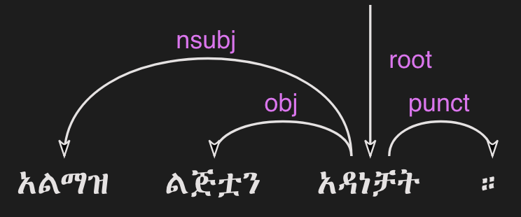
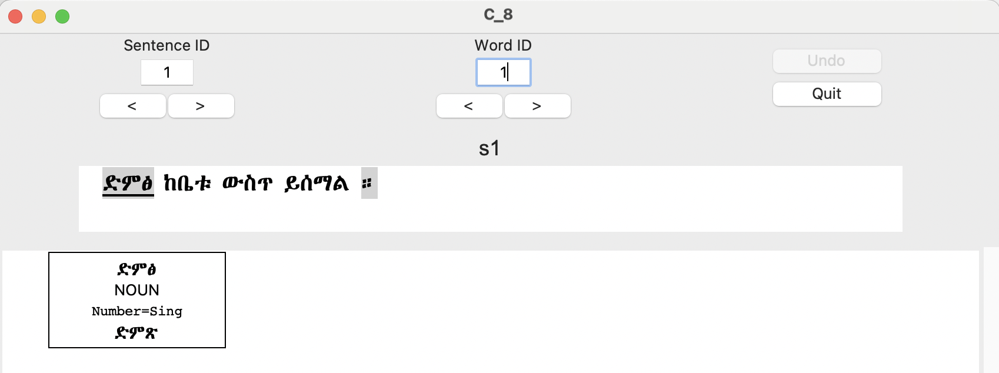

# HornMorpho,version 5.1
#### 2024.6.30

## Changes since version 5.0

- Starting in HornMorpho 5.1, the data for particular languages is not included in the distribution. Once you have installed HM, you will need to download the data from the language(s) you want to work with. See the [Installation](#install) section below.

- Version 5.1 adds Oromo to the languages included.

## Introduction

***HornMorpho*** (HM) is a Python program that performs morphological analysis and generation in various languages of the Horn of Africa.
The languages supported in Version 5.1 are Amharic (አማርኛ), Oromo (Afaan Oromoo, Oromiffa), and Tigrinya (Tigrigna, ትግርኛ).
Most examples within this document are Amharic; future versions will include more examples from the other languages.

If your application can benefit from explicit linguistic information about the structure and grammatical properties of words in these languages, then you may want to use HM.
HM can tell you, for example, that the verb የማይደረገው is negative, that the noun አባቴን is the object of some verb, that the stem (the word without prefixes and suffixes) of the verb የምንፈልጋቸው is -ፈልግ-, that the lemma (basic form) of the verb እንደሚመኟቸው is ተመኘ, that is, that this verb has something to do with 'longing'.
HM can also tell you that the word እንደሚመኟቸው consists of five segments (morphemes): እንደም+ይ+መኝ+ኡ+ኣቸው.

HM is a rule-based program; that is, the knowledge in the program is based on explicit linguistic rules and a *lexicon*, a dictionary of basic word forms (stems and roots), rather than on machine learning of the knowledge from a corpus. For Amharic, the lexicon is extracted mainly from Amsalu Aklilu's *Amharic-English Dictionary* (Addis Ababa, Kuraz, 2004). For Tigrinya, the lexicon is from Thomas Leiper Kane's *Tigrinya-English Dictionary* (Kensington, MD, USA, Dunwoody Press, 2000). For Oromo, the lexicon is from two dictionaries, Gene B. Gragg's *Oromo Dictionary* (African Studies Center, Michigan State University, 1982) and Tamene Bitima's *A Dictionary of Oromo Technical Terms (Oromo-English)* (Rüdiger Köppe, Köln, 2000). The rules come from many grammars of the languages. Though HM does not make use of machine learning, it is possible to use its output in models that do. For example, [Gezmu & Nürnberger (2023)](https://dl.acm.org/doi/10.1145/3610773) uses HM's segmentation of Amharic words for neural machine translation.

HM assigns a *part-of-speech* (POS) to each word, but if you want a POS tagger, you should look elsewhere. A word's POS often depends on the other words in the sentence in which it occurs, and HM analyzes words without looking at their context.

HM has a list of Amharic person and place names, but if you want *named entity recognition*, you should look for a program that has been trained to do this. If a name is not in HM's list for Amharic, it will just be treated as an unknown word, and this will be true for almost all names in Tigrinya and Oromo.

**Version 5 replaces Version 4.5 for Amharic. For other languages, see Version 4.3. Version 5 is not backward compatible with earlier versions. If you have used earlier versions of HM and would like to switch to Version 5, please contact [gasser@iu.edu](mailto:gasser@iu.edu) for help.**

## <a id="install">Installation</a>

It is highly recommended that you install the program in a [virtual environment](https://realpython.com/python-virtual-environments-a-primer/), but this is not required.
If you are using a virtual environment, you will need to create the environment and activate it before running `pip install`.

First download the wheel file from the `dist/` folder: [HornMorpho-5.1-py3-none-any.whl](https://github.com/hltdi/HornMorpho/blob/master/dist/HornMorpho-5.1-py3-none-any.whl)

Then, to install from the wheel file, do the following in a Python shell from the folder where the wheel file is

	pip install HornMorpho-5.1-py3-none-any.whl

If this fails, it may mean that you don't have [`wheel`](https://pypi.org/project/wheel/) installed, so try again after installing `wheel`.

Then to use the program, in a Python shell, do

	>>> import hm
	
The first time you use HornMorpho, you will need to download the data for the languages that you will be using. To download a language, do this

	>>> hm.download(language)
	
where `language` is `a` for Amharic, `t` for Tigrinya, or `o` for Amharic.
This will download the compressed file from the HornMorpho Github repository and then uncompress it.
If you try to use any of the functions described below without first downloading the data for the relevant language, you will be prompted to
download the data.

If you have problems with installation, contact [gasser@iu.edu](mailto:gasser@iu.edu).

## Quickstart

If you aren't interested in learning more about what HM can do and just want to use it to analyze the words in a corpus of sentences,
this section has the minimum that you'll need to know.

To analyze the words in a corpus, use the function `anal_corpus()`, passing the sentences as a list of strings, using the keyword `data`, or as a path to a file containing the sentences, using the keyword `path`.

	(1)
	>>> c = hm.anal_corpus('a', data=["በሶ የበላው አበበ አይደለም ።", "ጫላ ጩቤዬን ጨብጧል ።"])
	
This returns an instance of the class `Corpus`, which has a `write()` method that you can call to write the analyses to a file, using the keyword `path`, or to standard output if you specify no path.
You can tell which word attributes you want to write with the keyword `attribs`.
Some possible attributes are part-of-speech (`'pos'`), morphological features (`'um'`), segmentation into morphemes (`'seg'`), and lemma (`'lemma'`).

	(2)
	>>> c.write(attribs=['pos', 'um', 'lemma'])
	በሶ የበላው አበበ አይደለም ።
	በሶ	N	SG	በሶ
	የበላው	V	*RELC;3;DEF;MASC;PFV;SG	በላ
	አበበ	V	3;MASC;PFV;SG	አበበ
	አይደለም	COP	3;MASC;NEG;PRS;SG	ነው
	።	PUNCT		

	ጫላ ጩቤዬን ጨብጧል ።
	ጫላ	PROPN	SG	ጫላ
	ጩቤዬን	N	ACC;PSS1S;SG	ጩቤ
	ጨብጧል	V	3;MASC;PRF;SG	ጨበጠ
	።	PUNCT

## Overview of the program

HM is a rule-based morphological analyzer and generator, implemented in the form of *finite-state transducers* weighted with *feature structures*. For the theory behind the program, see [Gasser (2011)](https://www.researchgate.net/publication/228910448_HornMorpho_a_system_for_morphological_processing_of_Amharic_Oromo_and_Tigrinya).

Most users of HM will be interested in morphological analysis.
The program also works in the opposite direction, performing morphological generation, taking as input the root and grammatical features of a word and returning the word form.
Documentation of the generation functions is forthcoming.
<!--
For generation, see the section on [Morphological Generation](#generation).
-->

The simplest HM function, `anal`, takes a word and returns an instance of the `Word` class.
An HM `Word` is a `list` of Python `dict`s, each representing a separate analysis of the input word.[^1]
You can use the usual Python ways of accessing the elements in a `list` or `dict`. For example, here is how you would analyze the Amharic word የቤታችን. The first argument to `anal` specifies the language;`'a'` is Amharic, `'t'` Tigrinya, `'o'` Oromo.
	
	(3)
	>>> w = hm.anal('a', "የቤታችን")

[^1]: As we'll see below, words out of context can be morphologically ambiguous, with more than one possible analysis.

The keys in the `dict` for an analysis of a word represent different pieces of information that you may be interested in. For example, you may want the *lemma* of the input word.
This is the basic form of the word.
For nouns in all of the languages, this is the stem of the word without any prefixes or suffixes.
Here's how you'd get the lemma for the above analysis of the word የቤታችን.
 `w[0]` returns the first analysis `dict` in the `list` of analyses, and `w[0]['lemma']` returns the value associated with the keyword `lemma` in this `dict`.[^2]

[^2]: In general it's safer to use the `dict` function `get`(*`keyword`*) than the `[keyword]` notation because not all analyses include all keywords, and *`dict`*`[keyword]` returns an error if *`keyword`* is not in *`dict`*.

	(4)
	>>> w[0]['lemma']
	'ቤት'

Other `dict` keys are described [below](#keywords).

You will probably not want to use HM to analyze individual words, as in the above example.
There are also functions for analyzing sentences and corpora of sentences, [anal_sentence()](#anal_sentence) and [anal_corpus()](#anal_corpus), described below.
These functions call `anal()` on the words in the sentences.

### <a id="segmentation">Morphological segmentation</a>

#### Morphemes

A morphologically complex word consists of multiple *morphemes*, that is, more than one meaningful unit. One morpheme, the *stem*, is the part that conveys the basic meaning (the *lexical* meaning) of the word. The other morphemes, those that appear before the stem (as *prefixes*), after the stem (as *suffixes*) or within the stem (as *infixes*), modify the lexical meaning in various ways. For example, the Amharic word ለቤቶቻችን 'for our houses' consists of the stem ቤት and three additional morphemes, the prefix ለ- and the suffixes -ኦች and -ኣችን.[^3]

[^3]: For prefixes and suffixes beginning with the vowel /a/, HM uses the character ኣ. For suffixes beginning with the vowel /ǝ/, it uses the character አ rather than the usual Amharic character ኧ. This convention agrees with normal spelling rules in most other languages written with the Ge'ez script, which do not use the character ኧ.

#### Segmentation

A morphological segmentation of a word consists of a representation of the sequence of morphemes that make up the word.
Morphological segmentation may be useful in NLP applications that make use of subword units, for example, language models.
In these cases it provides an alternative to segmentation methods that are not informed by linguistic knowledge, such as [byte pair encoding and the WordPiece method] (https://arxiv.org/abs/2004.03720).

To get the segmentation of an analysis of a word, use the keyword `'seg'`. HM represents the segmentation of the word ለቤቶቻችን in the following way.
	
	(5)
	>>> w = hm.anal('a', 'ለቤቶቻችን')
	>>> w[0]['seg']            
	'ለ-<ቤት>ኦች-ኣችን--'

The stem is the part between `<` and `>`.
The instances of `-` separate the other morphemes. When `-` is not followed by a morpheme, the word lacks a possible morpheme in a particular position.
Here are two other words showing prefixes and suffixes in other positions.

	(6)
	>>> w1 = hm.anal('a', 'ለየቤታቸው')
	>>> w1[0]['seg']
	'ለ-እየ<ቤት>-ኣቸው--'
	(7)
	>>> w2 = hm.anal('a', 'ቤቱንም')
	w2[0]['seg']            
	'-<ቤት>-ኡ-ን-ም'
	
#### Verb roots

Like nouns, verbs in all three languages have a stem, which can take suffixes and (in Amharic or Tigrinya) prefixes.
Here are two examples.
	
	(8)
	>>> w1 = hm.anal('a', 'አልሰበሩም')
	w1[0]['seg']
	'-ኣል-<ሰበር>ኡ--ም---'
	(9)
	>>> w2 = hm.anal('a', 'የማይሰብረው')
	w2[0]['seg']
	'የም-ኣ-ይ<ሰብር>-አው----'

But Amharic and Tigrinya verbs are much more complicated than nouns. As in other Semitic languges, the stem of a verb can be further separated into a *root*, consisting of a sequence of consonants, and a vowel *template*, consisting of a sequence of vowels and, in some case, the *gemination*, or lengthening of particular root consonants (Amharic: መጥበቅ).

For example, the stem of the verb in (8) above, ሰበር,  could in turn be segmented into the root, consisting of the consonants /s b r/, and the template, consisting of the vowel ǝ (ኧ) between /s/ and /b/ and the same vowel between /b/ and /r/, as well as the gemination of the /b/. We could represent this in the following way, indicating gemination with `/` before the lengthened consonant.

	(10)
	{ስ ብ ር} + {1 ǝ /2 ǝ 3}
	
Combining the root and template in (10), with `1=ስ`, `2=ብ`, and `3=ር`, gives the stem ሰ/በር (/sǝbbǝr/), to which the prefixes and suffixes in (8) are added to yield the final form አልሰበሩም.

You can get the root of a verb using the keyword `'root'`.

	(11)
	>>> w = hm.anal('a', 'ትሰብራላችሁ')
	>>>w[0]['root']
	'ስብር:A'

The letter following the characters in the root specifies the root *class*. HM distinguishes nine different root classes, each with particular sets of templates. Normally the class doesn't matter, but in some cases the same set of root consonants can belong to two different classes. This is true, for example, for the Amharic roots ጥብቅ:A 'wait for' and ጥብቅ:B 'be tight'.

	(12)
	>>> w1 = hm.anal('a', 'ጠብቂው')
	w1[0]['root']
	'ጥብቅ:B'
	(13)
	>>> w2 = hm.anal('a', 'አጥብቂው')
	w2[0]['root']
	'ጥብቅ:A'
	
Oromo verbs are simpler, but they also have a stem that is followed by one or more suffixes, and this stem in turn can consist of a root followed by one or more suffixes. For example, the verb *adeemsiise* has the *adeemsiis-*, which in turn consists of the root *adeem-* followed by the causative suffix *-siis*.

	(14)
	>>> w = hm.anal('o', "adeemsiise")
	>>> w[0]['seg']                            
	'<adeem-siis>e-'

#### Morpheme variation and normalization

Prefixes and suffixes may take different forms depending on what precedes or follows them, and they may also affect the form of the stem that they are attached to. For example, consider the suffix that means 'my', that is, the first person singular possessive suffix.
When this follows a consonant, it is pronounced /-e/ (ኤ) , as, for example, in ቤቴ. When it follows a vowel, however, it is usually pronounced /-ye/ (ዬ), as for example, in ሥራዬ. To indicate that these forms are actually the same morpheme, in HM they appear in one, canonical, form.

	(15)
	>>> w1 = hm.anal('a', "ቤቴ")
	>>> w1[0]['seg']
	'-<ቤት>-ኤ--'
	(16)
	>>> w2 = hm.anal('a', "ሥራዬ")
	>>> w2[0]['seg']
	'-<ስራ>-ኤ--'
	
Here is a more complicated example with verbs. It shows how the suffix -ኢ /i/, indicating that the subject of the verb is second person feminine singular, can take different forms and can affect the end of the stem that it follows. In this case, HM normalizes both the stem and the suffix.
Note how the segmentations in both (17) and (18) contain the suffix -ኢ and how the stem in the segmentations in both (18) and (19) is መርጥ.

	(17)
	>>> w1 = hm.anal('a', 'ትፈልጊያለሽ')
	>>> w1[0]['seg']
	'--ት<ፈልግ>ኢ---ኣለሽ--'
	(18)
	>>> w2 = hm.anal('a', 'ትመርጫለሽ')
	>>> w2[0]['seg']
	'--ት<መርጥ>ኢ---ኣለሽ--'
	(19)
	>>> w3 = hm.anal('a', 'ትመርጣለህ')
	>>> w3[0]['seg']
	'--ት<መርጥ>---ኣለህ--'

#### Character normalization

Example (16) illustrates another HM feature. The Amharic and Tigrinya writing systems have some characters that have the same pronunciation, for example, ስ and ሥ, and because the choice of a character within these sets is not standardized, in HM, the spelling of words is normalized. That is, characters with the same pronunciation are mapped to a single character. Thus both ሥራ and ስራ appear in HM output as ስራ; both ጸጉር and ፀጉር appear as ጸጉር. In Tigrinya, both ስራሕ and ሥራሕ appear in HM output as ስራሕ; both መጸ and መፀ appear as መጸ.

### <a id="features">Morphological features</a>

In addition to segmenting a word, morphological analysis can yield a set of *grammatical (or morphological) features*, which, together with the word's stem, completely describe the word.

For example, given the Amharic word ለቤቶቻችን, morphological analysis should tell us that the stem of this word is the noun ቤት (so it refers to a house) and that it in addition has three grammatical features: it is plural (it refers to more than one house), it has the preposition ለ- (it means "for" or "to" the houses in question), and it has the possessive suffix -ኣችን (so the houses are "our" houses).

HM represents morphological features in terms of an internal format that you probably won't have to deal with and, in addition, in terms of the features used in two cross-linguistic projects, Universal Morphology and Universal Dependencies.

The [Universal Morphology project](https://unimorph.github.io/) (UM) aims to develop a set of morphological features that permit morphological annotation of data from any language.
The features are defined as values along 23 dimensions, for example, gender and number, but many of these are not relevant for a given language such as Amharic or Tigrinya.
For a given word, the UM specification consists of a list of all of the feature values that apply to that word, separated by semicolons. To see the UM features for an analyzed word in HM, use the keyword `'um'`.

	(20)
	>>> w = hm.anal('a', 'ለቤቶቻችን')
	>>> w[0]['um']            
	'DAT;PL;PSS1P'

The first of these features, `DAT`, is an abbreviation of *dative*, a linguistic term that describes some (though not all) of the functions of the preposition ለ-. You can think of `DAT` as standing in for all of these functions. The second, `PL`, indicates that the word is plural. The third, `PSS1P`, is an abbreviation of *first person plural possessive*, that is, 'our' in English.

For verbs, the features includes ones for *subject agreement*, that is, features specifying the person, number, and gender of the subject of the verb, and ones for *aspect*, that is features related to the time of the event or state referred to by the verb.

	(21)
	>>> w1 = hm.anal('a', 'ትፈልጋለች')
	>>> w1[0]['um']            
	'3;FEM;IPFV;SG'
	(22)
	>>> w2 = hm.anal('a', 'ፈለገች')
	>>> w2[0]['um']            
	'3;FEM;PFV;SG'
	
In both (21) and (22) the subject is third person (`'3'`) singular (`'SG'`) feminine (`'FEM'`), that is, 'she'. In (21), the aspect is *imperfective* (`'IPFV'`), corresponding roughly to English present or future. In (22), the aspect is *perfective* (`'PFV'`), corresponding roughly to English past.

The full range of grammatical features that are output by HM will not be described here.
You can find out more about UM features in [Sylak-Glassman (2016)](https://unimorph.github.io/doc/unimorph-schema.pdf).
HM adds several features that are not part of the UM set; these are preceded by `'*'` in the HM output.

#### <a id="dependencies">Dependencies and CoNLL-U Format</a>

There are two levels of structure in sentences: morphology, structure within words, and *syntax*, structure between words.
Syntactic structure can be represented in terms of labeled directed arcs joining words, known as syntactic relations or *dependencies*.
Here is a simple Amharic example.
The arrow from አዳነቻት to አልማዝ denotes the dependency with *head* አዳነቻት and *dependent* አልማዝ; አልማዝ is the subject (`'nsubj'`) of አዳነቻት.

(23) 

One very influential syntactic framework in NLP, similar to the Universal Morphology project, is the [Universal Depencency project] (https://universaldependencies.org/) (UD), which seeks to develop a set of universal dependencies that could adequately cover the syntactic structure of all languages.

Because morphology and syntax are related, annotating sentences within the UD framework includes not only linking words with dependencies but also assigning morphological features to words and possibly linking some of the morphemes within words by dependencies.
Here is how that might appear for the sentence in (23).

(24) 

Although morphological features in UD are based on those in UM, the format is different.
You can see the UD features in an analysis with the keyword `'udfeats'`.
Here are the UD features for the words in examples (19) and (20).

	(25)
	>>> w1 = hm.anal('a', 'ለቤቶቻችን')
	>>> w1[0]['udfeats']
	'Case=Dat|Number=Plur|Number[psor]=Plur|Person[psor]=1'
	(26)
	>>> w2 = hm.anal('a', 'ትፈልጋለች')
	>>> w2[0]['udfeats']
	'Aspect=Imp|Gender=Fem|Number=Sing|Person=3'

In UD, annotated sentences are represented in a plain text format known as [CoNLL-U] (https://universaldependencies.org/format.html).
Each word is assigned a line, with ten slots for its properties, including morphological features and POS.
There are a number of [tools for annotating sentences] (https://universaldependencies.org/tools.html#third-party-tools) using files in CoNNL-U format.

With the function `anal_corpus()`, HM allows a user to analyze the words in a set of sentences and save the analyses in a file in CoNLL-U format, including the morphological information (segmentation, morphological features, within-word depencies) and POS tags but not the dependencies between the words in the sentences.
The resulting file can then be uploaded using one of the annotation tools so that the dependencies can be added.
To learn how to use HM to create CoNNL-U files, see [this section] (#conllu).

#### <a id="ambiguity">Ambiguity</a>

Many words are ambiguous; they may have multiple interpretations.
Sometimes the ambiguity is orthographic; that is, the spelling represents two different words with different pronunciations.
This can happen in Amharic and Tigrinya because the orthography does not indicate gemination.
For example, the Amharic verb ይሰማሉ can mean either 'they hear' or 'they are heard', depending on the gemination of the /s/ and /m/.
Besides gemination, these two interpretations can be distinguished on the basis of their lemmas, ሰማ in the first case, ተሰማ in the second.
Other words are ambiguous because forms with the same pronunciation can have multiple interpretations.
For example, the Amharic verb ብትመጣ can mean either 'if you (masc.) come' of 'if she comes'; that is, the two interpretations differ in their grammatical features.

Each HM `Word` is a `list` of analyses, one for each possible interpretation that HM finds.

	(27)
	>>> w1 = hm.anal('a', 'ይሰማሉ')            
	>>> w1[0]['lemma']
	'ሰማ'
	>>> w1[1]['lemma']
	'ተሰማ'
	(28)
	>>> w2 = hm.anal('a', 'ብትመጣ')
	>>> w2[0]['um']
	'2;COND;IPFV;MASC;SG'
	>>> w2[1]['um']
	'3;COND;FEM;IPFV;SG'

HM analyses include consonant gemination, but by default, the gemination is omitted in the output. To show gemination, indicated by `/` before the geminated consonant, you can use the keyword `degem=False`.
This can show, for example, the difference in the pronunciation of the two analyses of ይሰማሉ.

	(29)
	>>> w3 = hm.anal('a', 'ይሰማሉ', degem=False)
	>>> w3[0]['seg']
	'--ይ<ሰማ>---ኣ/ሉ--'
	>>> w3[1]['seg']
	'--ይ</ሰ/ማ>---ኣ/ሉ--'
	
HM attempts to order the analyses of ambiguous words on the basis of their relative frequency, but the frequency estimates are still somewhat crude, so you should not assume that the first analysis is always the most likely one.

<!--
### <a id="generation">Morphological generation</a>
-->

## Functions

### <a id='anal'>`hm`.**`anal`**(*`language`*, *`word`*, *`**kwargs`*)</a>

Returns an instance of the [`Word`](#Word) class belonging to
the [`Language`](#Language) that is represented by the *`language`* argument.

If *`word`* belongs HM's list of common, unanalyzed words, the analysis returns no segmentation.

	(30)
	>>> w = hm.anal('a', "ወደ")
	>>> w[0]
	{'token': 'ወደ', 'pos': 'ADP', 'nsegs': 1, 'freq': 4999}
	
If HM cannot analyze *`word`*, it returns an unanalyzed representation of the word, with POS `'UNK'`. Note that HM is very strict when it comes to the spelling of words.

	(31)
	>>> w = hm.anal('a', "አላቹ")
	>>> w[0]
	{'seg': 'አላቹ', 'pos': 'UNK', 'nsegs': 1}
	
If the returned `Word` includes analyses, each is a `dict`, with keywords for the different aspects of the analysis that you can access.
See [below](#keywords) under the description of the `Word` class for a list of these keywords.
	
#### Parameters
 
- *`language`* is a string abbreviation of the language: `'a'` for Amharic, `'t'` for Tigrinya, `'o'` for Oromo. If the word's `Language` hasn't been instantiated, that happens when `anal()` is called. If the data for that `Language` has not been downloaded, the user is prompted to download it when `anal()` is called.

- *`word`* is a string representing an Amharic or Tigrinya word or, if `mwe=True` is specified, a multi-word phrase.

- *`**kwargs`* (keyword arguments with default values)

   - `degem=True`
   		
   		If `False`, specifies that the word's segments are not "degeminated," that is, that consonant gemination is indicated (see example (28) above).

   - `mwe=False`

   		If `True`, specifies that the *`word`* string contains one or two spaces and that HM should try to analyze it as a *multi-word expression* (MWE). HM knows a limited number of MWEs, so this will not always succeed as expected.
	
			(32)
			>>> w1 = hm.anal('a', "የትምህርት ቤታቸው", mwe=True)
			w1[0]['seg']
			'የ--ትምህርት <ቤት>-ኣቸው--'
			>>> w1[0]['lemma']
			'ቤት'
			(33)
			>>> w2 = hm.anal('a', "ብድግ ብለው", mwe=True)            
			>>> w2[0]['seg']
			'ብድግ --<ብል>አው-----'
			>>> w2[0]['lemma']            
			'አለ'
			
### <a id='anal_sentence'>`hm`.**`anal_sentence`**(*`language`*, *`sentence`*, *`**kwargs`*)</a>

Returns an instance of the `Sentence` class.

#### Parameters

- *`language`* is a string abbreviation of the language, as for
[`anal`](#anal).

- *`sentence`* is a string representation of a sentence to be analyzed.

You can get a list of analyzed `Word` instances in the sentence using the `Sentence` attribute `words`.

	(34)
	>>> s = hm.anal_sentence('a', "ጫላ ጩቤ ጨበጠ ።")
	>>> s.words
	[W16:ጫላ[1], W18:ጩቤ[1], W19:ጨበጠ[1], W20:።[1]]
	>>> for word in s.words:
   		    print(word[0].get('pos'))
	PROPN
	N
	V
	PUNCT

`anal_sentence()` tries to find known multi-word expressions before it analyzes individual words in the sentence.

	(35)
	>>> s = hm.anal_sentence('a', 'ዝም ብላ ትምህርት ቤት ገባች ።')
	>>> s.words
	[W4:ዝም ብላ[1], W5:ትምህርት ቤት[1], W6:ገባች[1], W7:።[1]]
	>>> for word in s.words:
   			print(word[0].get('seg'))
	ዝም --<ብል>ኣ-----
	--ትምህርት <ቤት>---
	--<ገባ>አች-----
	None
	
### <a id='anal_corpus'>`hm`.**`anal_corpus`**(*`language`*, *`**kwargs`*)</a>

Returns an instance of the [`Corpus`](#Corpus) class.
A `Corpus`'s `sentences` attribute is a list of `Sentence` instances.

#### Parameters
- *`language`* is a string abbreviation of the language, as for
[`anal`](#anal)

- *`**kwargs`* (keyword arguments with default values)

	- `data=None`

		A list of strings, each representing an unanalyzed sentence, or `None`. If `data` is not `None`, each of the sentences is analyzed with `anal_sentence()`, and the resulting `Sentence` objects are stored in the `Corpus`'s `sentences` attribute.

			(36)
			>>> c = hm.anal_corpus('a', data=['አበበ በሶ በላ ።', 'ጫላ ጩቤ ጭበጠ ።'])
			>>> c.sentences
			[S1::አበበ በሶ በላ ።, S1::ጫላ ጩቤ ጭበጠ ።]
			>>> c.sentences[0].words[2][0]['um']
			'3;MASC;PFV;SG'
			>>> c.sentences[1].words[0][0]['pos']
			'PROPN'

	- `path=None`

		A string representing a path to a file containing unanalyzed sentences, one per line, or `None`. If `data` is `None`, and `path` is not `None`,
the sentences in the file are read in and analyzed with `anal_sentence()`, and the resulting `Sentence` objects are stored in the `Corpus`'s `sentences` attribute.

	- `degem=False`: as for `anal`

	- `disambiguate=False`
	
		If `True`, `Corpus.disambiguate()` is called, opening a GUI in which the user can select analyses for ambiguous words. This only works within the set of functions that create CoNNL-U representations for sentences.
See [this section](#conllu) to find out more.

	- `start=0`
	
		If `path` is specified, `start` gives the index of the sentence in the file to begin from. The default is `0`, the first sentence.
	
	- `n_sents=0`
	
		If `path` is specified and `n_sents` is not `0`, it specifies the number of sentences to be analyzed and added to the corpus.
	
	- `name=''`
	
		If `name` is not empty, the corpus is named `C_`*`name`*. Otherwise its name is `C_#`, where `#` is a unique integer.
	
## Classes
Normally you will not need to instantiate any of these classes directly. Instead you will be creating them using the functions above.

### <a id="Language">*`class`* **`Language`**(**`**kwargs`**)</a>

A `Language` is created using the static method `Language.make()`.

`Language.make()` is called whenever any of the analysis methods, `anal()`, `anal_sentence()`, or `anal_corpus()`, is called for the first time with the language's abbreviation.

An instantiated `Language` consists of a set of properties, which are read in from files called `*.lg` and `*.um`, where `*` is the language's abbreviation, and a set of *finite-state transducers* (FSTs) for each POS, loaded from compiled [*pickle*](https://realpython.com/python-pickle-module/) files.
These FSTs include the combined lexical and grammatical information for the particular POS.

Normally you should not need to change any of these files.
If you would like to add to or correct the knowledge that HM has for a particular language, please contact [gasser@iu.edu](mailto:gasser@iu.edu).

### <a id="Word">*`class`* **`Word`**(*`analyses`*)</a>

`Word` is a subclass of `list`. Each element of the list is a `dict` representing a single analysis of a word string.
See below for the keywords in the analysis `dict`s.

Instances of `Word` are normally created by the analysis functions, [`anal()`](#anal), [`anal_sentence()`](#anal_sentence), and [`anal_corpus()`](#anal_corpus).

#### <a id="keywords">Analysis keywords</a>

An analysis `dict` may have the following possible keywords. (Note that not all keywords appear for words that are not actually analyzed, for example, prepositions like ወደ and conjunctions like ግን, or for unknown words.)

- `'token'`

	The input word string.
	
- `'pos'`

	The word's part-of-speech.
	
- `'lemma'`

	The word's lemma. For nouns and adjectives, this is the stem, that is, the form of the word with no prefixes or suffixes. For Amharic and Tigrinya verbs, this is the third person singular masculine perfective form.
		
		(37)
		>>> w = hm.anal('a', "ያነጋግሩታል")
		>>> w[0]['lemma']            
		'አነጋገረ'

	For Oromo verbs, the lemma is the infinitive.
		
		(38)
		>>> w = hm.anal('o', "dubbattani")
		w[0]['lemma']
		'dubbachuu'

- `'root'`

	For nouns this is the same as the lemma. For Amharic and Tigrinya verbs, it consists of the consonants in the verb's root, followed by a letter representing the root's class.
For some Amharic roots, HM uses the characters እ or ይ to represent consonants that were pronounced at some point in the language's history but now only affect the particular vowels that appear.

		(39)
		>>> w1 = hm.anal('a', "ብሉት")
		>>> w1[0]['root']
		'ብልእ:A'
		(40)
		>>> w2 = hm.anal('a', "ፃፈችው")
		>>> w2[0]['root']
		'ጽእፍ:A'
		(41)
		>>> w3 = hm.anal('a', "ሰለቸኝ")
		>>> w3[0]['root']
		'ስልችይ:E'
		
	For Oromo verbs, the root is either the same as the stem, or
it is a more basic form to which suffixes representing additional meanings have been added. For many verbs, HornMorpho will return both possibilities as separate analyses.

		(42)
		>>> w = hm.anal('o', "banamaniiru")
		>>> w[0]['seg'];w[0]['um'];w[0]['root']
		'<banam>aniiru-'
		'3;PFV;PL'
		'banam'
		>>> w[1]['seg'];w[1]['um'];w[1]['root']
		'<ban-am>aniiru-'
		'3;PASS;PFV;PL'
		'ban'

- `'um'`

	The UM features for the analysis. See examples (20), (21), (22), and (28).

- `'seg'`

	The segmentation of the word into its constituent morphemes, with `-` representing morpheme positions that are empty and `< >` enclosing the word's stem. See examples (5)-(9), (15)-(19), and (29).

- `'pre'`, `'suf'`, `'stem'`

	The prefixes, suffixes, and stem of the word.
	Each is a list of `dict`s, or `''` if a position is empty.
	Each `dict` contains keys for the morpheme's form (`'seg'`); its POS (`'pos'`); the index within the word of its dependency head (`'head'`), that is, the index of the stem; its relation to the word's head (`'dep'`); and a set of features that are relevant for [UD CoNLL-U] (#conllu) format (`'udfeats'`).
	
		(43)
		>>> w = hm.anal('a', 'ሲያጎበድዱላቸውና')
		>>> w[0]['pre']
		[{'seg': 'ስ', 'pos': 'SCONJ', 'dep': 'mark', 'head': 2}, '', {'seg': 'ይ', 'pos': 'PRON', 'dep': 'nsubj', 'head': 2}]
		>>> w[0]['stem']
		{'seg': 'ኣ-ጎበድድ', 'pos': 'V', 'head': 2, 'udfeats': 'Aspect=Imp|ClauseType=AdvCl|DatNum=Plur|DatPers=3|Number=Plur|Person=3|Voice=Trans'}
		>>> w[0]['suf']
		[{'seg': 'ኡ', 'pos': 'PRON', 'dep': 'nsubj', 'head': 2}, {'seg': 'ላቸው', 'pos': 'PRON', 'dep': 'obl', 'head': 2}, '', '', '', {'seg': 'ና', 'pos': 'CCONJ', 'dep': 'cc', 'head': 2}]

- `'freq'`

	An estimate of the frequency of the word's stem within a corpus, used to sort analyses.

- `'udfeats'`

	The set of morphological features in Universal Depencency format. See examples (25) and (26). This is only something you need to know about if you are using HM for to create a file of sentences in [CoNNL-U format](#conllu).

### <a id="Sentence">*`class`* **`Sentence`**(*`language`*, *`sentence`*, *`**kwargs`*)</a>

#### Parameters

- *`language`* is a string abbreviation of the language, as for [`anal()`](#anal).

- *`sentence`* is a string representation of a sentence. HM doesn't have a tokenizer, so it is assumed that the sentence is already tokenized, in particular, that punctuation is separated from words.

- *`**kwargs`* (keyword arguments)

  - `degem=True`
   		
  		As for `anal()`, if `False`, specifies that the segments of each word are not "degeminated," that is, that consonant gemination is indicated (see example (29) above).

#### Attribute
- `hm.Sentence.words`.
	A `list` of analyzed `Word` objects.

### <a id="Corpus">*`class`* **`Corpus`**(*`**kwargs`*)</a>

#### Parameters
- *`**kwargs`*: see [`anal_corpus()`](#anal_corpus)

#### Attribute
- `hm.Corpus.sentences`.
	A `list` of analyzed `Sentence` objects.

#### Method
- `hm.Corpus.write`(*`path`*, *`properties`*)

	Writes specified properties of the analyses in the corpus's sentences to a file or standard output. See example (2).
	
	##### Parameters
	- *`path`*

		A string representing a path to a file or `None`.
		If `None`, the analyses are written to standard output.
	- *`properties`*

		A `list` of strings consisting of analysis [keywords](#keywords) to be written, for example, `'pos'` and `'seg'`.

## <a id="conllu">Working with CoNLL-U format</a>

The features described in this section are being used as part of a project to create Amharic and Tigrinya treebanks.
Many of the details, in particular the way in which words are segmented and the dependencies within words,
are being reevaluated and may change in upcoming versions of HM.
If you would like to use HM as part of a treebank project, please contact [gasser@indiana.edu](mailto:gasser@indiana.edu). I may be able to tailor some of the features of the program to suit your needs.

To create representations of the sentences in a corpus in CoNLL-U format,
first pass `disambiguate=True` to `anal_corpus()` when you call it on the corpus.
After the sentences in the corpus have been analyzed (with `anal_sentence()`), a GUI window will open so that you can select analyses for ambiguous words by hand.

	(44)
	>>> c = hm.anal_corpus("a", data=["ድምፅ ከቤቱ ውስጥ ይሰማል ።"], disambiguate=True)

(45)	

The GUI displays the analyses for one word at a time, beginning with the first word in the first sentence. The current word is underlined where the current sentence is displayed.

To move to the next or the previous word in the current sentence, use the directional buttons under "Word ID" (or the arrow keys). To move to the next or the previous sentence, use the buttons under "Sentence ID".

Unambiguous words are displayed with gray backgrounds, for example, the word  ድምፅ in figure (45) above. The word's single analysis is shown in the space at the bottom of the window.

Figure (46) shows an example of an ambiguous word, ከቤቱ. The options are shown in the two yellow boxes under the ambiguous suffix, which can mean either 'his' (the upper box) or 'the' (the lower box).
To choose one of the options, click on your choice.

(46)

Figure (47) shows another sort of ambiguity, for the word ይሰማል.  Two entire analyses are shown at the bottom of the window. The difference between the two interpretations, 'hears' and 'is heard', is represented in HM in terms of the features (one is `PASS` (passive); the other is not) and in terms of the different lemmas, ሰማ and ተሰማ. To choose one of the options for cases like this, click on the number to the left of the analysis, 2 in this case.

(47)

There is an `Undo` button to allow you to undo selections that have made.
When you are finished disambiguating, clicking on `Quit` closes the window.
The analyses will have been updated for all of the words that you have disambiguated; that is, each of these words will now have only one CoNNL-U style analysis.

To write the CoNLL-U representations to a file or standard output, pass `conllu=True` to the `Corpus` method `write()`.

	(48)
	>>> c.write(conllu=True)
                   
	# text = ድምፅ ከቤቱ ውስጥ ይሰማል ።
	# sent_id = s1
	1	ድምፅ	ድምጽ	NOUN	NOUN	Number=Sing	1	_	_	_
	2-4	ከቤቱ	_	_	_	_	_	_	_	_
	2	ከ	ከ	ADP	ADP	Case=Abl	3	case	_	_
	3	ቤት	ቤት	NOUN	NOUN	_	3	_	_	_
	4	ኡ	ኡ	DET	DET	Definite=Def	3	det	_	_
	5	ውስጥ	ውስጥ	ADP	ADP	_	5	_	_	_
	6-8	ይሰማል	_	_	_	_	_	_	_	_
	6	ይ	ይ	PRON	PRON	Gender=Masc|Number=Sing|Person=3	7	nsubj	_	_
	7	ሰማ	ተሰማ	VERB	VERB	Aspect=Imp|Voice=Pass	7	_	_	_
	8	ኣል	ኣል	AUX	AUX	_	7	aux	_	_
	9	።	።	PUNCT	PUNCT	_	9	_	_	_

A file with these representations can then be uploaded to a UD annotation tool like [Arborator](https://arboratorgrew.elizia.net), where you can add the dependencies between words.
